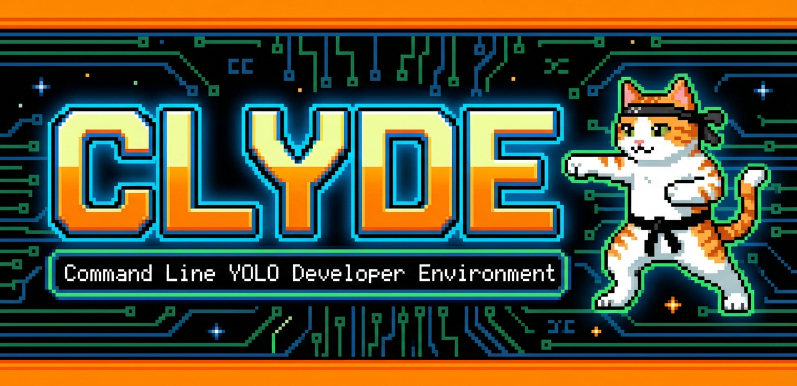

# CLYDE

Clyde is being redesigned as a **least-privilege development system for Rust and full-stack applications with strong support for agentic coding**.

This branch is focused on the **clean-slate architecture and design work** for that next version.

## Status

This repository currently contains:

- the **legacy Docker-based implementation** in `bin/` and `docker/`
- a new **Clyde Next design document set** in `docs/`

The design direction assumes:
- untrusted code may execute during build, test, install, and codegen
- credentials must be **brokered, not mounted**
- network should be **denied by default**
- build, test, sign, and publish must be **separate trust domains**
- coding agents should operate through **missions, leases, typed tasks, and approvals** rather than ambient shell authority

## Clyde Next document set

Start here:

1. [Problem Statement and Threat Model](docs/problem-statement-threat-model.md)
2. [Requirements](docs/requirements.md)
3. [Competitive Alternatives](docs/competitive-alternatives.md)
4. [High-Level Design](docs/high-level-design.md)

Detailed design:

- [Mission and Capability Lease Model](docs/mission-lease-model.md)
- [Task Policy Matrix](docs/task-policy-matrix.md)
- [Sequence Flows and Interaction Scenarios](docs/sequence-flows.md)
- [Component Architecture](docs/component-architecture.md)
- [Technology and Library Choices](docs/technology-choices.md)
- [MVP Implementation Roadmap](docs/mvp-implementation-roadmap.md)

## Design summary

Clyde Next is intended to be:

- a **trusted local or self-hosted control plane**
- a **secure execution system** for hostile build/test/install workflows
- a **developer-facing workspace** for humans and coding agents
- a **credential broker** for git, signing, and publish operations
- an **artifact and audit system** connecting all trust boundaries

Core design ideas:

- **missions** define a bounded goal and autonomy envelope
- **leases** grant temporary scoped authority to agents and sub-agents
- **typed tasks** define how code executes under policy
- **snapshots** separate mutable editing from untrusted execution
- **brokers** separate authority from code execution

## Legacy implementation

The existing Docker-based Clyde implementation remains in the repository as a reference point during the redesign, but it does **not** represent the target architecture for Clyde Next.

## Near-term focus

The current design work is primarily focused on:

- Rust build/test isolation
- full-stack dependency and browser-test isolation
- agent/human interaction design
- mission/lease/task policy model
- sandbox and broker architecture for an MVP
